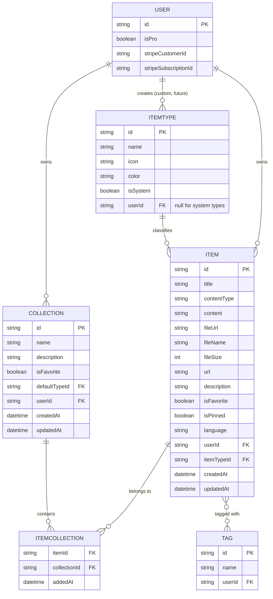
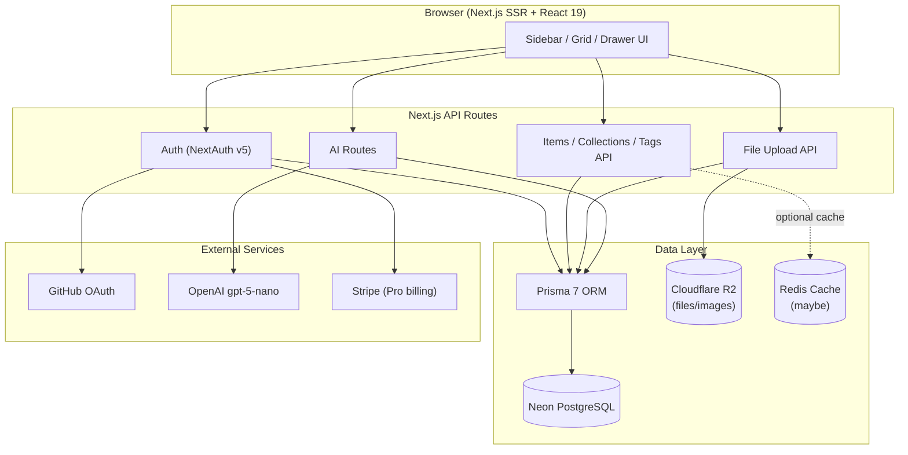
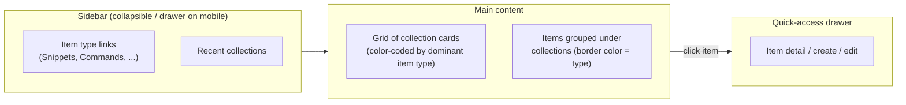

# DevStash — Project Overview

> One fast, searchable, AI-enhanced hub for all your dev knowledge & resources.

---

## Table of Contents

1. [Problem](#problem)
2. [Target Users](#target-users)
3. [Core Concepts](#core-concepts)
4. [Feature Set](#feature-set)
5. [Data Model](#data-model)
6. [Tech Stack](#tech-stack)
7. [System Architecture](#system-architecture)
8. [Monetization](#monetization)
9. [UI/UX Guidelines](#uiux-guidelines)
10. [Open Questions](#open-questions)

---

## Problem

Developers keep their essentials scattered across too many tools:

| Scattered Today | Should Live In |
|---|---|
| Code snippets | VS Code, Notion |
| AI prompts | Chat history |
| Context files | Buried in projects |
| Useful links | Browser bookmarks |
| Docs | Random folders |
| Commands | `.txt` files |
| Project templates | GitHub Gists |
| Terminal commands | Bash history |

**Result:** constant context switching, lost knowledge, inconsistent workflows.

**Solution:** DevStash — a single fast, searchable, AI-enhanced hub for all dev knowledge and resources.

---

## Target Users

| Persona | Core Need |
|---|---|
| 🧑‍💻 **Everyday Developer** | Fast capture/retrieval of snippets, prompts, commands, links |
| 🤖 **AI-First Developer** | Save prompts, contexts, workflows, system messages |
| 🎥 **Content Creator / Educator** | Store code blocks, explanations, course notes |
| 🏗️ **Full-Stack Builder** | Collect patterns, boilerplates, API examples |

---

## Core Concepts

### Items

The atomic unit of content. Every item has a **type**, which determines its content model:

| Storage Kind | Applies To |
|---|---|
| `text` | snippet, prompt, note, command |
| `url` | link |
| `file` | file *(Pro)*, image *(Pro)* |

**System types** (seeded, immutable, `userId = null`):

| Type | Color | Icon (lucide) |
|---|---|---|
| Snippet | `#3b82f6` (blue) | `Code` |
| Prompt | `#8b5cf6` (purple) | `Sparkles` |
| Command | `#f97316` (orange) | `Terminal` |
| Note | `#fde047` (yellow) | `StickyNote` |
| File *(Pro)* | `#6b7280` (gray) | `File` |
| Image *(Pro)* | `#ec4899` (pink) | `Image` |
| Link | `#10b981` (emerald) | `Link` |

Custom user-defined types are a **future** (post-launch) feature — the schema should support them from day one (`ItemType.userId` nullable, `isSystem` flag), even though the UI to create them ships later.

Items are created/edited from a **quick-access drawer**, not a full-page form — capture speed is the point.

### Collections

- A named grouping of items of *any* type (e.g. "React Patterns," "Interview Prep," "Context Files").
- **Many-to-many**: an item can belong to multiple collections simultaneously.
- Relationship is tracked via a join table (`ItemCollection`) that also records *when* the item was added.

### Tags

- Free-form, user-created, many-to-many with items.
- Primary lever for search filtering alongside type and collection.

---

## Feature Set

### Must-Have (MVP)

- [x] Item CRUD across all system types, created via quick drawer
- [x] Collections: create, favorite, assign items (multi-collection support)
- [x] View which collections an item belongs to
- [x] Full-text search across content, tags, titles, and type
- [x] Auth: email/password **and** GitHub OAuth (NextAuth v5)
- [x] Favorites (items & collections)
- [x] Pin items to top
- [x] Recently used list
- [x] Import code from a file
- [x] Markdown editor for text-based types
- [x] File upload for `file` / `image` types
- [x] Export data (multiple formats)
- [x] Dark mode (default) / light mode toggle
- [x] Syntax highlighting for code blocks

### Pro-Only (gated, but open to all during development)

- [ ] File & image uploads
- [ ] Custom item types *(later phase)*
- [ ] AI auto-tag suggestions
- [ ] AI summaries
- [ ] AI "Explain This Code"
- [ ] AI prompt optimizer
- [ ] Data export as JSON/ZIP
- [ ] Priority support

---

## Data Model

### Entity Relationship Diagram



### Prisma Schema (draft)

> Starting point only — refine field constraints, indexes, and cascade behavior before running a migration. Per your note: **never use `db push`**; always generate and review a migration (`prisma migrate dev`, then apply in prod via `prisma migrate deploy`).

```prisma
// schema.prisma

generator client {
  provider = "prisma-client-js"
}

datasource db {
  provider = "postgresql"
  url      = env("DATABASE_URL")
}

// ---------- Auth (NextAuth v5) ----------

model User {
  id                   String   @id @default(cuid())
  name                 String?
  email                String?  @unique
  emailVerified        DateTime?
  image                String?

  isPro                Boolean  @default(false)
  stripeCustomerId     String?  @unique
  stripeSubscriptionId String?  @unique

  accounts    Account[]
  sessions    Session[]
  items       Item[]
  collections Collection[]
  itemTypes   ItemType[]
  tags        Tag[]

  createdAt DateTime @default(now())
  updatedAt DateTime @updatedAt
}

model Account {
  id                String  @id @default(cuid())
  userId            String
  type              String
  provider          String
  providerAccountId String
  refresh_token     String? @db.Text
  access_token      String? @db.Text
  expires_at        Int?
  token_type        String?
  scope             String?
  id_token          String? @db.Text
  session_state     String?

  user User @relation(fields: [userId], references: [id], onDelete: Cascade)

  @@unique([provider, providerAccountId])
}

model Session {
  id           String   @id @default(cuid())
  sessionToken String   @unique
  userId       String
  expires      DateTime

  user User @relation(fields: [userId], references: [id], onDelete: Cascade)
}

// ---------- Core Domain ----------

enum ContentType {
  text
  url
  file
}

model ItemType {
  id       String  @id @default(cuid())
  name     String
  icon     String
  color    String
  isSystem Boolean @default(false)

  userId String?
  user   User?   @relation(fields: [userId], references: [id], onDelete: Cascade)

  items                Item[]
  defaultForCollections Collection[] @relation("DefaultType")

  createdAt DateTime @default(now())
  updatedAt DateTime @updatedAt

  @@unique([userId, name])
}

model Item {
  id          String      @id @default(cuid())
  title       String
  contentType ContentType

  content     String?     @db.Text  // text content, null if file
  fileUrl     String?                // R2 URL, null if text
  fileName    String?                // original filename
  fileSize    Int?                   // bytes
  url         String?                // for link type
  description String?     @db.Text
  language    String?                // optional, code highlighting hint

  isFavorite Boolean @default(false)
  isPinned   Boolean @default(false)

  userId     String
  user       User     @relation(fields: [userId], references: [id], onDelete: Cascade)

  itemTypeId String
  itemType   ItemType @relation(fields: [itemTypeId], references: [id])

  collections ItemCollection[]
  tags        ItemTag[]

  createdAt DateTime @default(now())
  updatedAt DateTime @updatedAt

  @@index([userId])
  @@index([itemTypeId])
}

model Collection {
  id          String  @id @default(cuid())
  name        String
  description String?
  isFavorite  Boolean @default(false)

  defaultTypeId String?
  defaultType   ItemType? @relation("DefaultType", fields: [defaultTypeId], references: [id])

  userId String
  user   User   @relation(fields: [userId], references: [id], onDelete: Cascade)

  items ItemCollection[]

  createdAt DateTime @default(now())
  updatedAt DateTime @updatedAt

  @@index([userId])
}

// Join table: Item <-> Collection (many-to-many)
model ItemCollection {
  itemId       String
  collectionId String
  addedAt      DateTime @default(now())

  item       Item       @relation(fields: [itemId], references: [id], onDelete: Cascade)
  collection Collection @relation(fields: [collectionId], references: [id], onDelete: Cascade)

  @@id([itemId, collectionId])
  @@index([collectionId])
}

model Tag {
  id     String @id @default(cuid())
  name   String

  userId String
  user   User   @relation(fields: [userId], references: [id], onDelete: Cascade)

  items ItemTag[]

  @@unique([userId, name])
}

// Join table: Item <-> Tag (many-to-many)
model ItemTag {
  itemId String
  tagId  String

  item Item @relation(fields: [itemId], references: [id], onDelete: Cascade)
  tag  Tag  @relation(fields: [tagId], references: [id], onDelete: Cascade)

  @@id([itemId, tagId])
  @@index([tagId])
}
```

**Notes / decisions to confirm:**
- `Item.content` vs `Item.url` vs `Item.fileUrl` are mutually exclusive depending on `contentType` — consider a Prisma-level check constraint or app-level validation, since Prisma doesn't support conditional-required fields natively.
- `ItemType.userId` nullable + `isSystem` boolean supports future custom types without a schema change later.
- Cascading deletes: deleting a `User` cascades to their `Item`, `Collection`, `Tag`, `ItemType` (custom) — confirm this is the desired behavior before migrating.

---

## Tech Stack

| Layer | Choice | Notes |
|---|---|---|
| Framework | **Next.js 16 / React 19** | SSR pages with dynamic client components |
| API | Next.js API routes | Items, file uploads, AI calls |
| Language | TypeScript | End to end |
| Database | **Neon (PostgreSQL)** | Serverless Postgres |
| ORM | **Prisma 7** | ⚠️ migrations only — never `db push` |
| Caching | Redis | *Maybe — evaluate need post-MVP* |
| File Storage | **Cloudflare R2** | For `file` / `image` uploads |
| Auth | **NextAuth v5** | Email/password + GitHub OAuth |
| AI | **OpenAI `gpt-5-nano`** | Auto-tagging, summaries, code explain, prompt optimization |
| Styling | **Tailwind CSS v4 + shadcn/ui** | — |

**Repo strategy:** single codebase/repo — minimizes overhead for a solo/small-team SaaS.

---

## System Architecture



---

## Monetization

Freemium model.

| | **Free** | **Pro — $8/mo or $72/yr** |
|---|---|---|
| Items | 50 total | Unlimited |
| Collections | 3 | Unlimited |
| System types | All except file/image | All, incl. file/image |
| Custom types | — | *(later phase, all tiers TBD)* |
| Search | Basic | Basic |
| File/image uploads | ❌ | ✅ |
| AI auto-tagging | ❌ | ✅ |
| AI code explanation | ❌ | ✅ |
| AI prompt optimizer | ❌ | ✅ |
| Data export | ❌ | ✅ JSON / ZIP |
| Support | Standard | Priority |

> **Dev-mode override:** during development, all users get full access regardless of `isPro` — but the `User.isPro`, `stripeCustomerId`, and `stripeSubscriptionId` fields, plus feature-gating checks, should be built now so Stripe integration is a later config change, not a re-architecture.

---

## UI/UX Guidelines

### General
- Modern, minimal, developer-focused
- **Dark mode by default**, light mode optional
- Clean typography, generous whitespace
- Subtle borders and shadows
- Reference points: **Notion, Linear, Raycast**
- Syntax highlighting on all code blocks

### Layout



- **Sidebar:** item-type shortcuts + recent collections
- **Main:** grid of collection cards, background color derived from the dominant item type inside; items nested under their collection with a border color matching their type
- **Item detail:** opens in a quick drawer, not a separate page — keep interaction latency low

### Responsive
- Desktop-first, but fully usable on mobile
- Sidebar collapses into a drawer on small viewports

### Micro-interactions
- Smooth transitions
- Hover states on cards
- Toast notifications for actions (save, delete, add to collection, etc.)
- Loading skeletons instead of spinners where possible

---

## Open Questions

- **Redis:** is caching actually needed at MVP scale, or premature? Revisit after usage data.
- **Custom item types:** confirm target release phase and whether they're a Pro-only feature.
- **Export formats:** which formats beyond JSON/ZIP (Markdown bundle? CSV for tabular items?).
- **`Item.content` validation:** enforce mutually-exclusive `content` / `url` / `fileUrl` at the DB level (check constraint) or app level (Zod schema)?
- **Collection color/icon:** is the "dominant item type" color computed live on read, or cached/denormalized on the `Collection` row for performance?
- **Rate limiting** on AI routes (`gpt-5-nano` calls) — needed to control cost from free-during-dev access?
